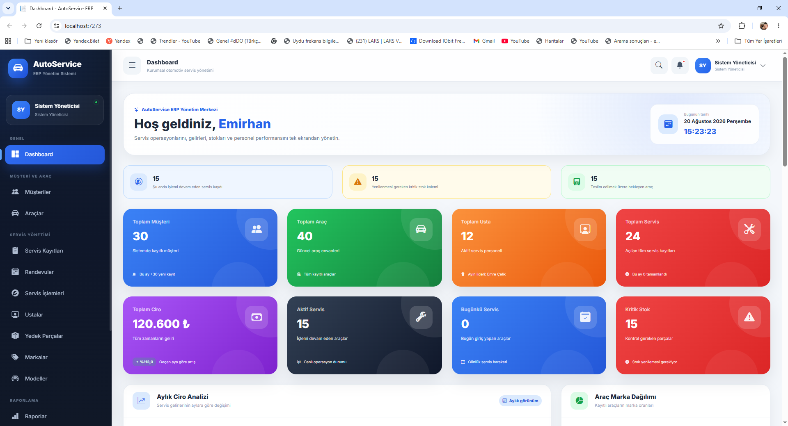
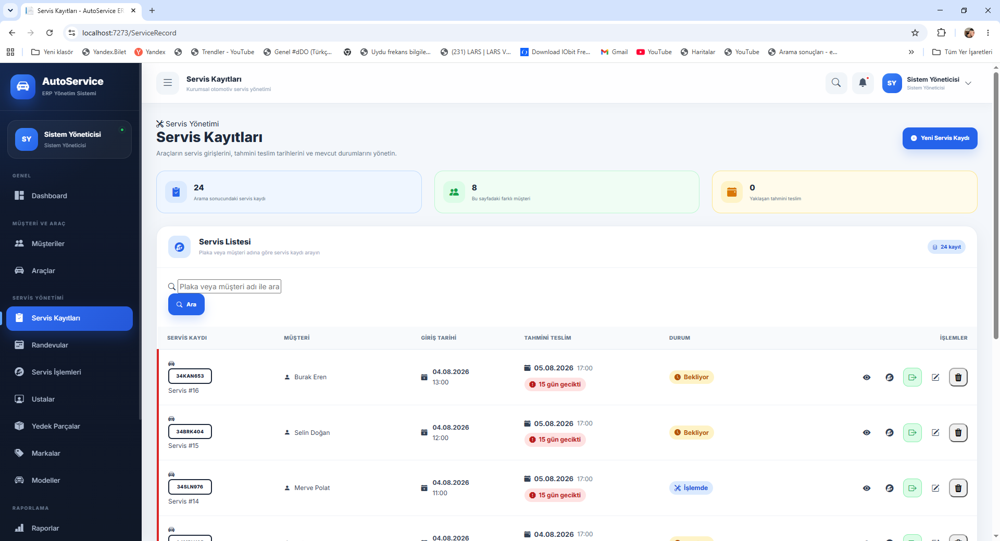
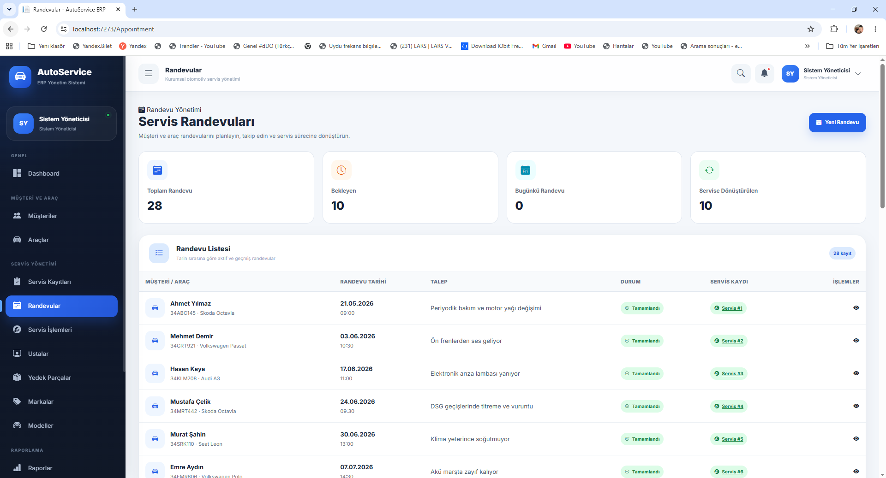
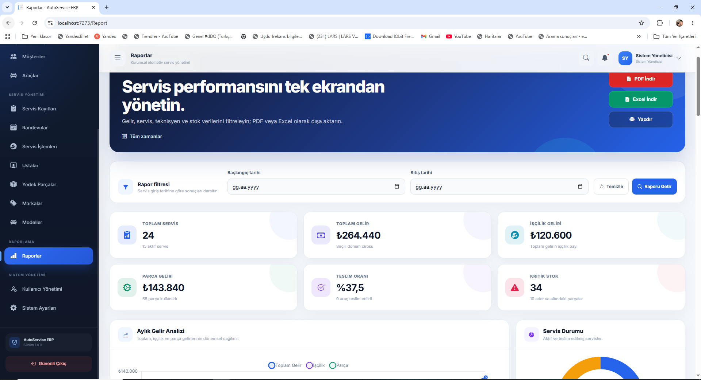

# 🚗 AutoService - Oto Servis ERP Yönetim Sistemi

AutoService, oto servis süreçlerinin tek bir sistem üzerinden yönetilmesi amacıyla geliştirilmiş **ASP.NET Core MVC** tabanlı kapsamlı bir web uygulamasıdır.

Proje; müşteri ve araç yönetiminden servis kayıtlarına, randevu süreçlerinden stok takibine ve finansal raporlamaya kadar oto servis operasyonlarının yönetilmesini sağlamaktadır.

## 📸 Uygulama Görselleri

### Dashboard

Dashboard üzerinden müşteri, araç, usta, servis, ciro, aktif servis ve kritik stok bilgileri takip edilebilmektedir.

### Servis Kayıtları

Araçların servis girişleri, müşteriler, tahmini teslim tarihleri ve servis durumları tek ekran üzerinden yönetilebilmektedir.

### Randevu Yönetimi

Müşteri ve araç randevuları oluşturulabilir, takip edilebilir ve servis kaydına dönüştürülebilir.

### Raporlama

Servis performansı, gelirler, işçilik ve parça gelirleri ile kritik stok bilgileri raporlanabilmektedir. Raporlar tarih aralığına göre filtrelenebilir ve PDF veya Excel formatında dışa aktarılabilir.

## ✨ Temel Özellikler

* Müşteri yönetimi
* Araç yönetimi
* Servis kayıtlarının oluşturulması ve takibi
* Randevu yönetimi
* Randevuların servis kaydına dönüştürülmesi
* Servis işlemleri ve işçilik takibi
* Usta ve personel yönetimi
* Yedek parça ve kritik stok takibi
* Araç marka ve model yönetimi
* Gelir ve servis performansı raporları
* Tarih bazlı rapor filtreleme
* PDF ve Excel rapor çıktıları
* Sistem ve firma ayarları
* Kullanıcı ve yetkilendirme yönetimi

## 🛠️ Kullanılan Teknolojiler

* C#
* .NET / ASP.NET Core MVC
* Entity Framework Core
* Microsoft SQL Server
* HTML
* CSS
* Bootstrap
* Git / GitHub

## 🏗️ Proje Mimarisi

Proje, sorumlulukların ayrılması ve sürdürülebilir bir kod yapısı oluşturulması amacıyla **katmanlı mimari** yaklaşımıyla geliştirilmiştir.

### AutoService.Entity

Veritabanı varlıklarının ve temel modellerin bulunduğu katmandır.

### AutoService.DataAccess

Entity Framework Core kullanılarak veritabanı işlemlerinin gerçekleştirildiği veri erişim katmanıdır.

### AutoService.Business

Uygulamanın iş kurallarının ve servislerinin yönetildiği katmandır.

### AutoService.Dto

Katmanlar arasında veri aktarımı için kullanılan DTO sınıflarını içerir.

### AutoService.Web

Controller, View ve kullanıcı arayüzünün bulunduğu ASP.NET Core MVC web katmanıdır.

## 💻 Projede Uygulanan Yapılar

* CRUD işlemleri
* Katmanlı mimari
* Entity Framework Core
* Microsoft SQL Server entegrasyonu
* Dependency Injection
* DTO kullanımı
* ASP.NET Core MVC
* Veri filtreleme ve raporlama
* Kullanıcı yetkilendirme

## 🎯 Projenin Amacı

Bu proje ile gerçek bir oto servis işletmesinin ihtiyaçları modellenerek **ASP.NET Core MVC, Entity Framework Core, SQL Server, katmanlı mimari ve kurumsal web uygulaması geliştirme** konularında uygulamalı deneyim kazanılması amaçlanmıştır.

## 👨‍💻 Geliştirici

**Emirhan Şahin**

C# / .NET Backend Developer
